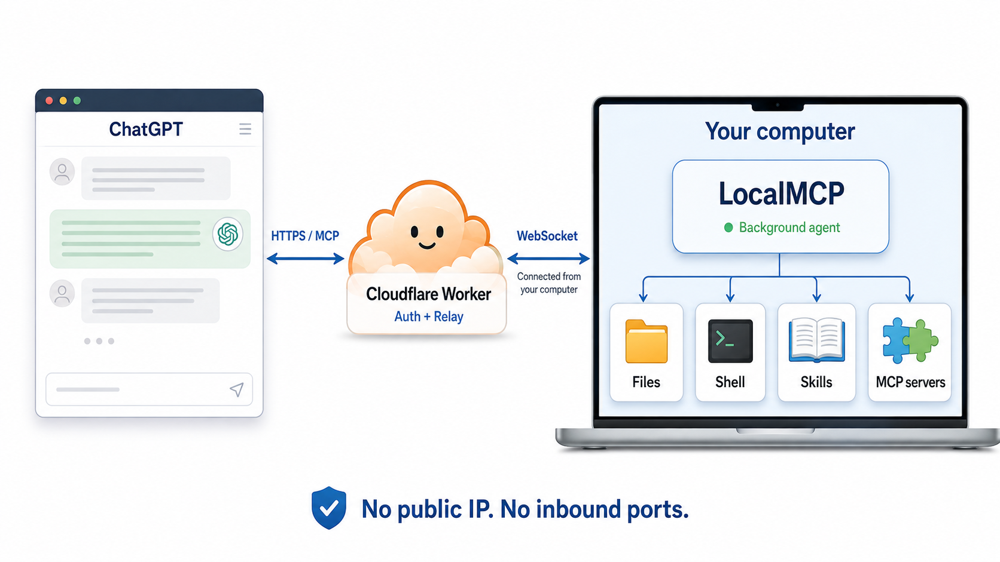
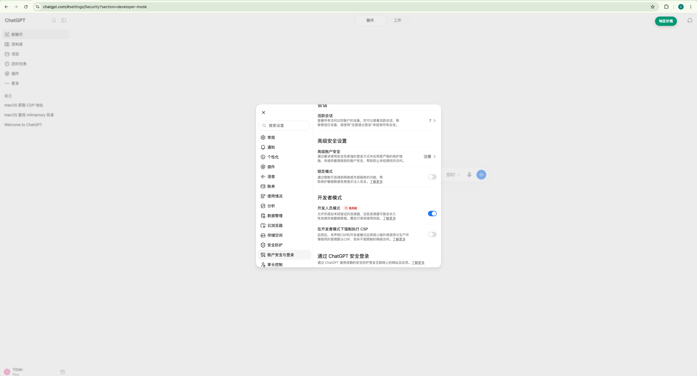
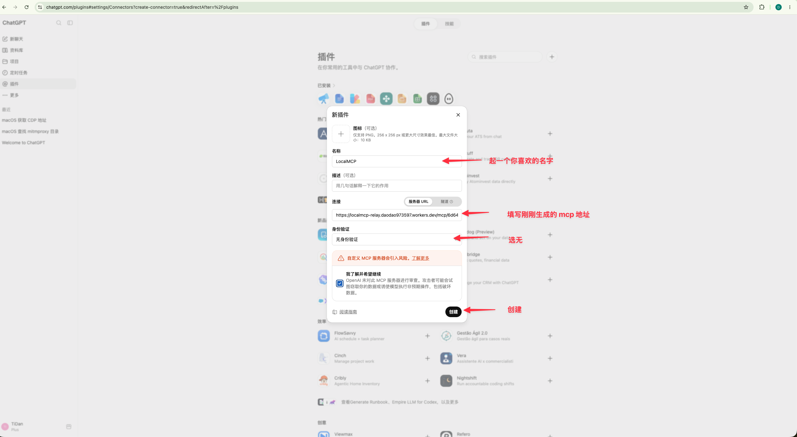

# LocalMCP - 榨干 ChatGPT 的所有价值

让 ChatGPT 网页端使用你的本机开发能力：文件操作、Shell、持久进程、Skills 和可插拔 MCP Server。



本机主动通过 WebSocket 连接 Cloudflare Worker，由 Worker 负责认证与请求中继，无需公网 IP 或开放入站端口。

## 快速开始

需要 **Node.js 22+**。

```sh
npm install -g @daodao97/localmcp
localmcp
```

首次运行会自动创建 `~/.localmcp/` 配置、向默认公共 Worker 注册独立设备，并在后台启动 Agent。连接成功后会输出完整 MCP URL，关闭终端不会停止服务。

在 ChatGPT 中添加 MCP 连接，服务器 URL 填入输出的完整地址，身份验证选择 **None**。

> 完整 MCP URL 包含访问凭证，请勿公开分享或提交到 Git。

## 常用命令

```sh
localmcp          # 启动后台服务，重复执行会复用已有进程
localmcp status   # 查看状态、MCP URL 和日志路径
localmcp stop     # 停止后台服务
localmcp reload   # 校验并重新加载配置
localmcp agent    # 前台运行，便于调试
```

日志位于 `~/.localmcp/agent.log`。也支持 `localmcp stdio`，或通过 `LOCALMCP_TOKEN=<至少32字符的密钥> localmcp http` 启动本地 HTTP 服务。

## 自建 Worker（可选）

将中继部署到自己的 Cloudflare 账号，再让本机 LocalMCP 连接它。需要 Cloudflare 和 GitHub 账号。

### 1. 部署到 Cloudflare

[](https://deploy.workers.cloudflare.com/?url=https://github.com/daodao97/localmcp)

点击按钮，按提示登录、连接 GitHub 并创建仓库，然后点击 **Deploy**。Cloudflare 会根据仓库配置部署 Worker 和 SQLite Durable Object，无需手动创建数据库或填写密钥。按钮流程见 [Cloudflare 官方说明](https://developers.cloudflare.com/workers/platform/deploy-buttons/)。

部署成功后，在 Worker 的 **Settings → Domains & Routes** 中复制 `workers.dev` 地址，例如 `https://localmcp-relay.YOUR-SUBDOMAIN.workers.dev`。

<details>
<summary>也可以通过命令行部署</summary>

```sh
git clone https://github.com/daodao97/localmcp.git
cd localmcp
npm ci
npx wrangler login
npm run worker:deploy
```

复制命令输出中的 Worker 地址，然后继续下面的连接步骤。

</details>

### 2. 连接本机

安装 LocalMCP，并用你的 Worker 地址启动：

```sh
npm install -g @daodao97/localmcp
LOCALMCP_WORKER_URL=https://localmcp-relay.YOUR-SUBDOMAIN.workers.dev localmcp
```

首次连接会自动注册设备，将地址和凭证保存到 `~/.localmcp/worker.json`；之后直接运行 `localmcp` 即可，无需再设置环境变量，也无需运行 `worker:setup` 或 `worker:secrets`。

**如果已经连接过公共 Worker 或其他 Worker**，先停止服务并备份旧凭证，再执行上面的启动命令。仅修改环境变量不会重新注册设备：

```sh
localmcp stop
mv ~/.localmcp/worker.json ~/.localmcp/worker.json.backup-$(date +%Y%m%d%H%M%S)
LOCALMCP_WORKER_URL=https://localmcp-relay.YOUR-SUBDOMAIN.workers.dev localmcp
```

### 3. 在 ChatGPT 中使用

1. 运行 `localmcp status`，复制输出的完整 MCP URL（包含 `/mcp/<设备ID>/<密钥>`）。
2. 在 ChatGPT 网页端 打开开发者模式, [点我打开](https://chatgpt.com/#settings/Security?section=developer-mode)

   

3. 在 ChatGPT 网页端 新建插件, [点我打开](https://chatgpt.com/plugins#settings/Connectors?create-connector=true&redirectAfter=%2Fplugins)

   

4. 在对话中 @LocalMCP 开始使用

```sh
curl https://localmcp-relay.YOUR-SUBDOMAIN.workers.dev/healthz
# 预期：{"ok":true,"service":"localmcp-relay","registration":true}
```

## 开发

```sh
npm ci
npm run check
npm test
npm run build
```

## 配置与扩展

编辑 `~/.localmcp/localmcp.json` 后会自动热更新，无需手动 reload；通过 `LOCALMCP_CONFIG` 指定的配置文件同样支持。内容稳定约一秒后生效，支持编辑器原子保存。以下示例配置工作区并开启 Shell：

```json
{
  "workspaces": {
    "project": "/Users/me/code/project"
  },
  "defaultWorkspace": "project",
  "features": {
    "files": true,
    "shell": true,
    "processes": true
  },
  "skills": {
    "dir": "skills",
    "enabled": ["local-development"]
  },
  "mcpServers": {}
}
```

- **多工作区**：在 `workspaces` 中添加路径，调用工具时用 `workspace` 选择；省略时使用默认工作区。
- **Skills**：将操作说明放入 `~/.localmcp/skills/<名称>/SKILL.md`，并在 `skills.enabled` 中启用。
- **MCP 扩展**：在 `mcpServers` 中配置标准 MCP Server，例如下方的 Computer Use 服务；通过固定入口发现和调用工具，不再注册 `computer_*` 顶层工具。

```json
{
  "mcpServers": {
    "computer": {
      "enabled": true,
      "command": "cua-driver",
      "args": ["mcp"]
    }
  }
}
```

外部 MCP 使用三个固定工具：

| 工具 | 用途 |
| --- | --- |
| `list_mcp_servers` | 列出已加载的 MCP 服务 |
| `list_mcp_tools` | 按 `server` 查询当前工具说明、参数 schema 和注解 |
| `call_mcp_tool` | 传入 `server`、原始 `tool` 名称和 `arguments` 执行调用 |

例如先调用 `list_mcp_tools({"server":"computer"})`，确认参数后调用 `call_mcp_tool({"server":"computer","tool":"list_apps","arguments":{}})`。服务端按子工具的 schema 校验参数，保留图片、结构化结果和错误状态。统一调用入口按可能执行写操作、命令及网络访问标注，不承诺只读。

修改配置中的 MCP 或 Skill 设置后，等待自动热更新，再通过 `list_mcp_servers` / `list_mcp_tools` 或 `list_skills` / `read_skill` 发现新能力，对外工具列表保持不变。已加载 MCP 的工具变化可以直接重新调用 `list_mcp_tools` 获取。

热更新先校验配置并准备新的 MCP 服务，成功后再切换；JSON 错误、工作区路径无效、配置文件暂时消失或 MCP 启动失败时保留旧配置，原因写入服务日志。自动热更新不重启 Agent，不改变公网 URL，也不会中断正在执行的工具调用或清理已有持久进程。关闭 Shell/Processes 只限制后续调用，不会自动终止已启动进程。

仅监听主配置文件的内容变化；单独修改 `SKILL.md` 或 Worker 地址/凭证不会触发热更新。技能文件修改后仍可在外部终端运行 `localmcp reload`；手动 reload 会重启内部服务，不能通过 LocalMCP 自己的 `run_command` 同步执行。Worker 连接配置修改后需重启 Agent。

**从旧版迁移**：首次升级到固定入口后，客户端需要刷新一次工具列表并新建会话；旧的 `<server>_<tool>` 调用不再支持。已有 `~/.localmcp/skills/` 不会随 npm 升级自动覆盖，请同步更新其中引用旧工具名的技能说明。内置 Files/Shell/Processes 开关仍会改变顶层工具列表。

完整配置示例见 [localmcp.example.json](localmcp.example.json)。可通过 `LOCALMCP_CONFIG` 指定其他配置文件。

## License

MIT
